# Verificação de Identidade Digital
Notas sobre o processo de verificação de identidade digital, com foco na prestação de serviços públicos por entidades governamentais.

[💾](Notas-identidade-digital.pdf)

## O problema
O clamor pela transformação digital e a pressão por serviços remotos nos períodos pandêmico e pós-pandêmico são motores de inovação e exigem criteriosos requisitos de segurança e privacidade.

Qualquer serviço digital que permita o registro ou criação de contas (_onboarding_) está passível de fraude por parte do usuário solicitante, variando de contas _fake_ (onde o usuário não corresponde a uma pessoa legítima) a impersonificação (onde um agente malicioso se passa por uma pessoa legítima).

Devido à dificuldade e ao alto custo muitos serviços abrem mão da verificação, assumindo os riscos de negócio e de imagem. Porém, isso nem sempre está na mesa devido à regulações, _compliance_ ou necessidades de verificação rígidas associadas a custo, requisitos de negócio e privacidade. Notavelmente, redes sociais são exemplos de indústrias com baixo foco em verificação (e alta poluição com perfis _fakes_), em oposição às _fintechs_ (com seus processos de _onboarding_ 100% remotos).

Serviços governamentais frequentemente fazem esse tipo de análise de _trade-off_. Isso parece estar mudando, evidencias dadas pelas iniciativas federal ([gov.br](https://acesso.gov.br/)), estadual ([LoginSP](https://login.sp.gov.br/)) e municipal ([Login Único](https://legislacao.prefeitura.sp.gov.br/leis/decreto-60663-de-25-de-outubro-de-2021/detalhe)) (entre tantas outras) de centralização de identidade do cidadão.

No Brasil esse processo é notavelmente complexo devido à inexistência de cadastros compreensivos unificados com um nível de completude capaz de atender a diversos casos de uso, e à miríade de documentos de identificação e suas múltiplas versões.

Nesse cenário, serão discutidas alternativas para a implantação da verificação de identidade em um cenário plausível de uma aplicação governamental para prestação de serviços ao cidadão, onde ao se registrar é necessária a genuína verificação da identidade do próprio usuário, bem como sua presença física junto ao dispositivo no ato do cadastro.

Verificação de identidade, neste texto, se refere a combinação de diversas atividades realizadas durante o evento de interação onde o usuário alega possuir uma identidade no mundo real, geralmente em sua primeira interação (registro, cadastro, _onboarding_ e afins). Em diversos níveis de tolerância, busca-se verificar se a alegação procede, confirmando se a identidade real existe, se o usuário alegando posse da identidade é o seu verdadeiro possuidor, e sua presença genuína durante o processo.

Além da verificação, outros métodos podem ser utilizados, com menor nível de confiabilidade, para adicionar evidências de suporte à verificação. Vamos chamá-los de métodos de afirmação de identidade. Seu uso como única fonte de verificação é desencorajado.

Buscaremos alternativas à tradicional (e altamente confiável) verificação física de identidade realizada por agentes públicos em balcões de atendimento tradicionais, como no caso do serviço de identidade paulistano [Senha Web](https://www.prefeitura.sp.gov.br/cidade/secretarias/fazenda/servicos/senhaweb/), em prol de soluções nativamente remotas, em canais digitais.

## Técnicas
Várias alternativas são disponibilizadas pelo mercado. As soluções mais robustas devem utilizar a combinação de diversas técnicas em momentos diferentes para alcançar um nível de confiabilidade adequado ao problema.

Vamos discutir algumas das alternativas.

### Verificação de identidade do mundo real com foco em documentos
Consiste no uso de dispositivos de captura de imagem (_webcams_ ou câmeras de _smartphones_) em canais digitais remotos (tipicamente aplicações baseadas em _browser_ ou aplicativos _mobile_) para obtenção de imagens ou vídeos de documentos físicos.

  
[Imagem: biometricupdate.com](https://www.biometricupdate.com/201905/digital-identity-and-document-verification-market-to-generate-15-billion-by-2024)

A partir da captura podemos:
- identificar o documento (é um documento conhecido? [é um RG](https://www.terra.com.br/noticias/infograficos/nova-carteira-de-identidade/index.htm) ou uma CNH?);
- buscar por sinais de adulteração e falsificação;
- realizar OCR dos textos;
- obter a foto de identificação.

Normalmente esse processo está associado a um mecanismo de detecção de presença "ao vivo" (_liveness detection_, ou _Presentation Attack Detection_). Nesse caso, a foto do documento é comparada com uma _selfie_ do usuário tirada no momento do processo (imagem ou vídeo). Caso haja uma base prévia, também é possível realizar o reconhecimento facial.

  
[Imagem: computerid.com.br](https://computerid.com.br/solucoes/solucoes_view.php?c=10&s=16&p=9)

Este método entrega um nível aceitável de confiança, dada a presença de "algo que _somente você possui_" (seu documento) e "algo que _somente você é_" (sua face).

A técnica também é conhecida como "ID+_selfie_" ou "eKYC" (_eletronic- Know Your Consumer_).

### Afirmação de identidade do mundo real com foco em dados
Consiste na comparação dos dados fornecidos pelo usuário (nome, data de nascimento, endereço, …) com bases de dados confiáveis (registros governamentais, dados censitários, dados financeiros, …).

Pode se manifestar como uma verificação passiva (os dados são fornecidos pelo usuário e verificados pela aplicação) ou por algum método de desafio-resposta (onde o usuário é desafiado a responder corretamente a alguma pergunta criada com base em seus dados conhecidos previamente pela aplicação).

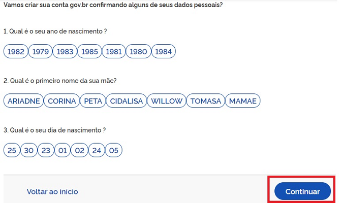  
[Fonte: gov.br](http://faq-login-unico.servicos.gov.br/en/latest/_perguntasdafaq/contaacesso.html#cadastro-com-as-informacoes-basicas-do-cidadao)

Esta técnica foi a mais utilizada pelo mercado durante muito tempo. Ainda assim, entrega um nível baixo de confiança, dada a dependência de "algo que _não somente você sabe_" (seus dados pessoais).

Considerando o crescimento de vazamentos de dados, engenharia social e _malwares_, não é recomendado seu uso como verificação de identidade, mas somente como suporte à verificação.

### Afirmação de identidade com foco em dispositivos
Consiste na geração de um identificador único do usuário baseado em informações combinadas de hardware e software do dispositivo do usuário, chamado de _device fingerprint_.

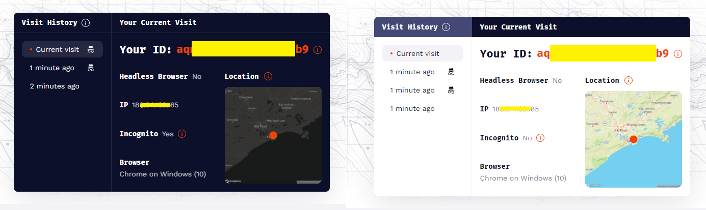  
[Identificação do usuário mesmo em abas anônimas (fingerprintjs.com)](https://fingerprintjs.com/)

Pode ser utilizado para inferir risco em alguns casos de uso de verificação de identidade em acessos subsequentes. Por exemplo, várias contas sendo criadas pelo mesmo dispositivo podem ser consideradas indício de fraude, assim como o acesso pelo mesmo dispositivo onde o cadastro foi criado pode ser um sinal de confiança.

### Afirmação de identidade com foco em atributos digitais
Consiste no uso de atributos digitais (como e-mail, endereços IP e perfis em redes sociais) para afirmação de identidade, preferencialmente em correlação com identidades do mundo real.

Segundo o Gartner, o e-mail tem se provado um atributo de identidade particularmente persistente, tendendo a permanecer por grandes períodos sem alteração.

Apesar de não poderem ser utilizados como identificação única e inequívoca, dados de geolocalização por IP podem ajudar a identificar fraudes caso divirjam consideravelmente do histórico do usuário ou de endereços previamente conhecidos.

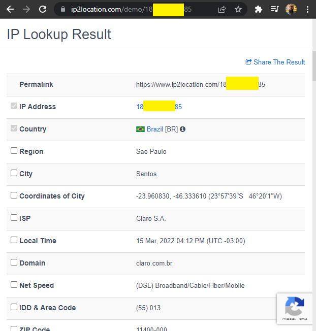  
[Serviço de geolocalização por IP](https://www.ip2location.com/demo/)

Também é comum considerar e-mails ou perfis recém-criados ou não encontrados em nenhuma base de dados anteriormente como potencialmente arriscados.

### Afirmação de identidade com foco em análise de comportamento
Consiste na criação de um perfil de usuário com base em seu comportamento (cadência de digitação, padrão de movimento de ponteiro do mouse, padrão de toque/arrasto), geralmente no primeiro uso de uma aplicação (ou de outra aplicação que compartilhe o perfil).

Pode ser usado para obter indícios de confirmação da identidade, ou para risco de fraude. Por exemplo, usuários podem ter dificuldades no preenchimento de um formulário que um agente malicioso não apresentaria (por repetir muitas vezes, ou por ser um _bot_ pré-programado).

### Afirmação de identidade com foco em número de telefone
Consiste no uso de dados obtidos pela rede telefônica para correlacionar o usuário com uma identidade do mundo real.

Entre as informações passíveis de uso estão:
- Ligação feita pelo dispositivo a uma central que identifica a chamada;
- Análise de sinal para detecção de possíveis grampos;
- Correlação de número telefônico com cadastro de proprietário;
- Idade do _SIM card_ (se muito recente pode indicar risco de fraude);
- Criação de perfil de voz;
- Identificação por voz (em acessos subsequentes).

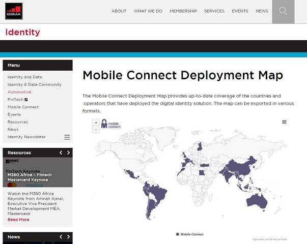  
[Brasil entre os países que suportam _GSMA Mobile Connect_](https://www.gsma.com/identity/mobile-connect-deployment-map)

## BYOI - _Bring Your Own Identity_
Um busca de reduzir a quantidade de identidades digitais que uma pessoa gerencia, o conceito de BYOI traz a ideia de reutilização das suas identidades reconhecidas em uma fonte confiável em outros pontos de acesso.

A maioria das implementações usam _Single Sign-On_ (SSO) via [OAuth](https://oauth.net/) e [OpenID](https://openid.net/). O nível de confiabilidade varia bastante conforme o emissor.

  
[Exemplos de serviços online que permitem login social no Auth0](https://auth0.com/blog/social-login-on-the-rise/)

Em termos de UX, a escolha de alguns poucos provedores é preferida. O de muitas opções prejudica o usuário tanto visualmente (["NASCAR problem"](https://indieweb.org/NASCAR_problem)) quanto funcionalmente (["paradoxo da escolha"](https://en.wikipedia.org/wiki/The_Paradox_of_Choice)).

### Redes Sociais
Identidades gerenciadas por sistemas de redes sociais, e-mails e outros serviços _online_ como Facebook, Google, Microsoft, Apple e afins.

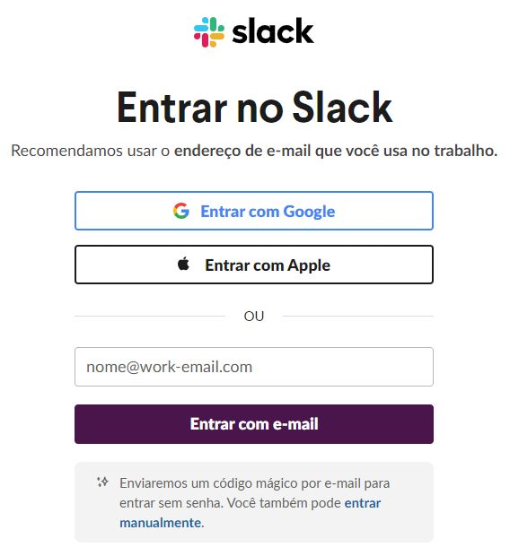  
[Tela de _login_ do Slack com opções de Login Social](https://slack.com/signin#/signin)

Podem garantir a diferenciação entre um usuário e outro, mas quase nada podem fazer para garantir que o usuário é quem ele diz ser (por exemplo, o possuidor de um CPF específico). O grande número de contas _fake_ torna desencorajador o seu uso como único método de identificação de uma pessoa real (apesar frequentemente ser suficiente para o comércio de produtos e serviços, por exemplo).

Comumente são utilizadas somente para autenticação, em forma de vínculos adicionais a uma conta já verificada anteriormente.

### Governo
Identidades digitais atestadas por uma entidade governamental responsável, geralmente carregando o peso das verificações físicas associadas.

O [gov.br](https://acesso.gov.br/) e o [LoginSP](https://login.sp.gov.br/) são iniciativas com esse fim, e permitem a integração das identidades entre diversos sistemas governamentais com alta confiabilidade e suporte a SSO com OAuth/OpenID. Em São Paulo, o [Senha Web](https://www.prefeitura.sp.gov.br/cidade/secretarias/fazenda/servicos/senhaweb/) possui verificação física de identidade em balcões de atendimento.

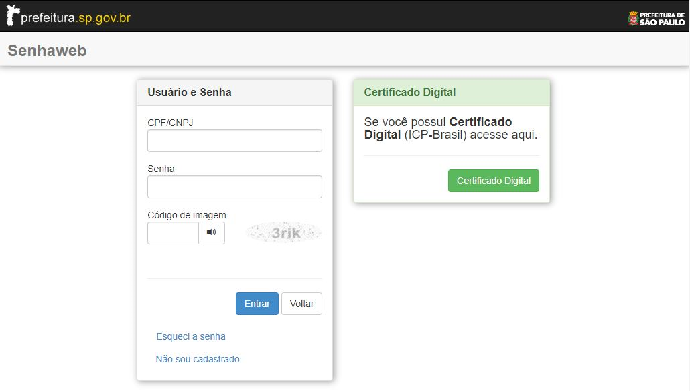  
[Senha Web permite autenticação com certificado digital](https://senhawebsts.prefeitura.sp.gov.br/)

Um exemplo híbrido é o [e-CPF](https://certificadodigital.imprensaoficial.com.br/certificados-digitais/e-cpf) (digital ou digital+físico, como nos tokens A3), que inclui as entidades certificadoras no processo, permitindo outros serviços como assinatura digital de documentos. 

  
[e-CPF físico (A3) emitido pela Prodesp](https://certificadodigital.imprensaoficial.com.br/certificados-digitais/e-cpf)

É utilizado, por exemplo, para afirmação de identidade no [gov.br](http://faq-login-unico.servicos.gov.br/en/latest/_perguntasdafaq/comoadquirircertificadodigitalpessoafisica.html), e como método de autenticação no [Senha Web](https://www.prefeitura.sp.gov.br/cidade/secretarias/fazenda/servicos/senhaweb/).

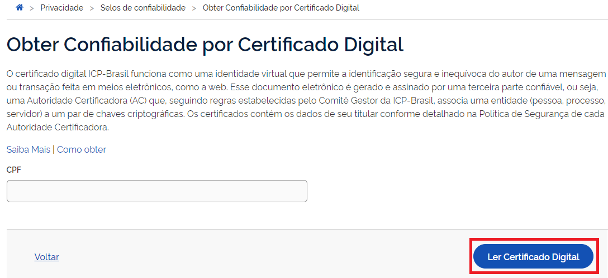  
[Afirmação de identidade com certificado digital no gov.br](http://faq-login-unico.servicos.gov.br/en/latest/_perguntasdafaq/comoadquirircertificadodigitalpessoafisica.html#como-atribuir-o-selo-certificado-digital-de-pessoa-fisica)

O uso de documentos legíveis por máquina com o uso de QrCode e NFC devem começar a se tornar realidade em um futuro próximo, pois já são suportados por alguns documentos, como na CNH, passaportes e o novo RG brasileiro.

### Instituições Financeiras
Bancos possuem uma grande base de usuários verificados, inclusive por razões de _compliance_, e podem prestar o serviço de verificação de identidade.

Com o crescimento do padrão [Open Banking](https://openbankingbrasil.org.br/), isso se torna uma realidade factível e de simples implementação, tornando os bancos em potenciais provedores de identidade para SSO.

No processo de registro do gov.br, dois métodos são disponibilizados em parceria com instituições bancárias. Em um deles usa-se SSO, e no outro gera-se um código de verificação (código NAI do _cidadão.br_/DataPrev) no _internet banking_ que é validado no processo de registro.

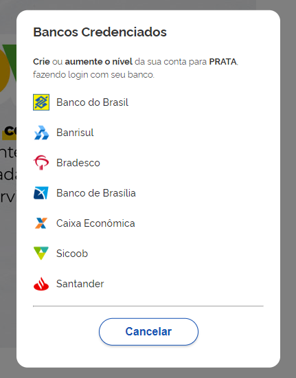  
[SSO com instituições bancárias no gov.br](https://acesso.gov.br/)

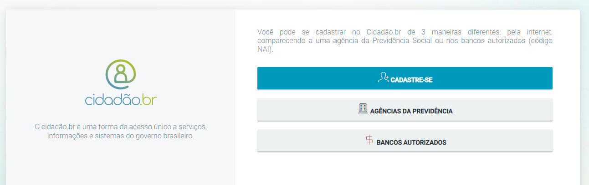  
[Uso do NAI no registro do cidadão.br](https://mte.api.dataprev.gov.br/auth/login?pat_first_access=true)

### Operadoras de Telefonia
O padrão [GSMA Mobile Connect](https://www.gsma.com/identity/mobile-connect) permite que operadoras de telefonia disponibilizem serviços de identidade com alta portabilidade por estarem vinculados aos _SIM cards_ dos dispositivos.

A autenticação e a afirmação são aplicações práticas, porém a confiabilidade da verificação varia de acordo com os requisitos nacionais de identificação no registro de compra de SIM cards, além de possuir cobertura limitada a poucos países (o Brasil é um deles).

Sua operação permite o SSO aprovado automaticamente quando solicitado pelo próprio dispositivo, ou então via aprovação com SMS caso em outro dispositivo.

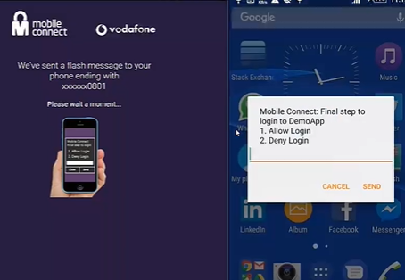  
[Exemplo de implementação de Mobile Connect com WSO2](https://wso2.com/library/webinars/2016/11/securing-access-to-saas-apps-with-gsma-mobile-connect/)

No futuro deve incluir biometria nos cadastros, o que pode simplificar o processo e melhorar a confiabilidade.

### Uso Corporativo e Provedores de BYOI
O mercado corporativo de verificação de identidade é bastante variado, incluindo provedores de identidade com as mais diversas fontes de verificação.

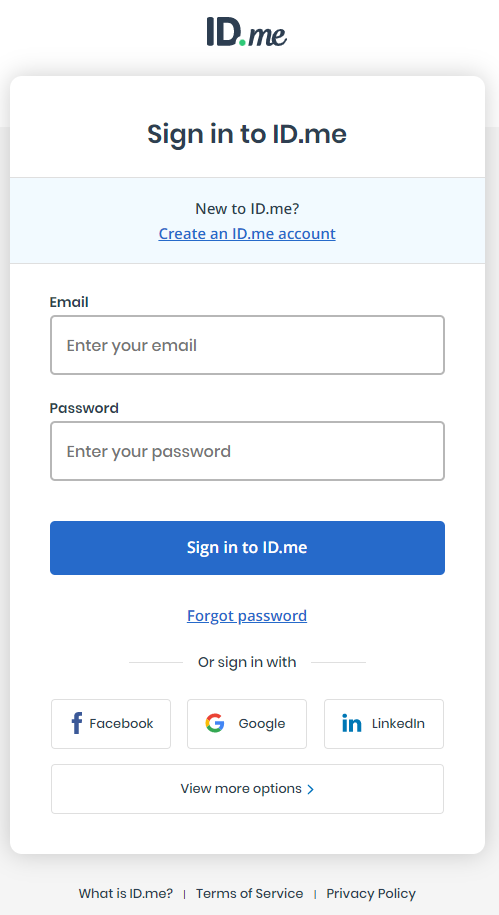  
[O provedor ID.me possui _compliance_ para diversos serviços governamentais americanos](https://www.id.me/business)

Além disso, organizações costumam integrar seus próprios diretórios de colaboradores como fontes de identidade, normalmente usando LDAP e Active Directory.

  
[Acesso usando conta Azure AD integrada para alunos das Escolas Técnicas Estaduais](http://etec.sp.gov.br/)

## Considerações adicionais para aquisição
### Viés demográfico
As soluções de detecção facial são probabilísticas, e dependem dos seus algoritmos e dos seus dados de treinamento. Há [diversos](https://arxiv.org/pdf/2103.01592.pdf) [estudos](http://proceedings.mlr.press/v81/buolamwini18a/buolamwini18a.pdf) que mostram que a diferença é significativa nos resultados de acordo com características demográficas como sexo, idade e etnia.

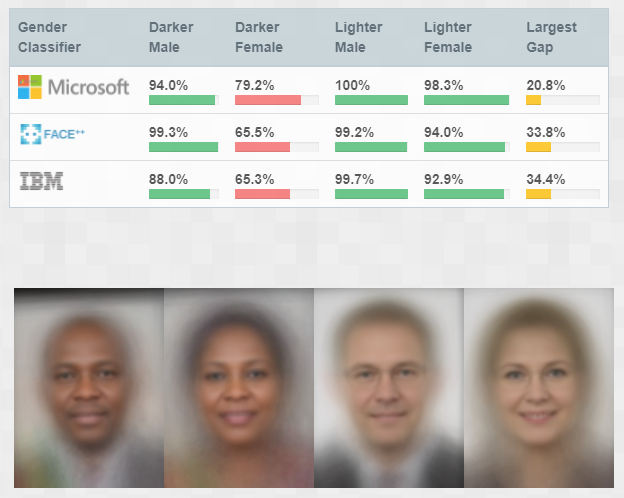  
[Algoritmos tem baixa precisão ao avaliar mulheres negras, segundo o estudo do GenderShades](http://gendershades.org/)

Dois tipos de erros são mais comuns:
- Falso positivo: duas imagens de pessoas diferentes são avaliadas como o mesma pessoa;
- Falso negativo: duas imagens da mesma pessoa são avaliadas como pessoas diferentes.

Segundo o Gartner, o número de falsos positivos entre pessoas asiáticas pode chegar a ser 100 vezes maior do que entre caucasianos. Esse número é reduzido em algoritmos desenvolvidos na Ásia. Falsos negativos são mais comuns em mulheres e pessoas jovens.

É importante avaliar os resultados, e medir os riscos de negócio, legais e de imagem.

### Corroboração de identidade
A afirmação baseada em dados normalmente se baseia em dados de fontes autoritativas convencionais, como fontes governamentais, financeiras, postais ou eleitorais.

O uso de fontes não convencionais podem ajudar, como verificação em entidades parceiras. Por exemplo, diferentes _e-commerces_ em uma mesma rede de confiança poderiam verificar se um usuário consta em uma base compartilhada, reduzindo a possibilidade de fraude.

Dados de registro também podem ser comparados em bases de dados de vazamentos, que poderiam indicar um possível uso indevido.

### Orquestração
Quanto maior o rol de funcionalidades que o caso de uso exija, menor será a chance de encontrar um fornecedor que as ofereça em um único produto. O grande desafio que se apresenta é realizar a orquestração dos diversos provedores em um _workflow_ robusto que não degrade a experiência do usuário, aumente a complexidade da solução, ou os custos. Um único ponto de integração é o ideal.

São características de um orquestrador:
- Configuração de _workflows_, preferencialmente em estilo _no-code_;
- Integração entre diversos fornecedores de verificação e afirmação;
- Normalização dos diferentes resultados;
- Gestão de políticas de _workflow_, de forma a controlar a UX (_go_/_no-go_);
- Ferramentas de análise e monitoramento;
- Flexibilidade para execução de testes A/B, facilitando a mudança de políticas;
- Redundância de _workflows_ entre diferentes fornecedores.

  
[Interface de configuração de _workflow_ de identidade - Okta](https://www.okta.com/platform/workflows/workflows-for-lifecycle-management/)

## _Features_ de provedores de identidade
### Integração
Suporte a aplicações web e _mobile_, disponibilização de SDKs e APIs, _deploys_ _on premises_ ou _cloud_.

### Captura de imagens de documentos
Disponibilização de UX amigável de captura.

### Cobertura de formatos
Identificação e OCR de diferentes documentos de diversas geografias, e seu processo de manutenção contínua.

### _Selfie_ e _liveness detection_
UX para captura ao vivo de _selfie_, permitindo verificação da presença do usuário.

### NFC, códigos de barras e QRCodes
Suporte à extração de dados armazenados em diferentes mídias.

### Automação
Uso de processos automatizados, usando validação por analistas somente em casos extremos.

### Acurácia
Baixa presença de falsos positivos/negativos e alta detecção de fraudes.

### Gestão do viés demográfico
Existência de métricas e clareza no trato da questão.

### Armazenamento de dados de identidade
Controle do cliente sobre os métodos e locais de armazenamento dos dados que identificam um usuário.

### Conexões com terceiros
Disponibilidade de integrações para verificação e afirmação pré-construídas, e facilidade na configuração/construção de outras.

### Deduplicação
Detecção e tratamento de duplicação de identidades.

### Autenticação
Configuração de diferentes fluxos para registro, autenticação e recuperação de contas de acordo com os requisitos do negócio.

### Aumento de dados de perfil
Dados que o provedor é capaz de adicionar a um perfil criado.

### _Dashboards_ e relatórios
Ferramentas de gestão do processo.

## Fornecedores

Abaixo, uma lista **não extensiva** de fornecedores de serviços de verificação identidade. Foram listados somente _players_ em que foi possível encontrar alguma referência de atendimento ao Brasil.

- [Acuant](https://www.acuant.com/) *
- [Daon](https://www.daon.com/) *
- [Serasa Experian](https://www.serasaexperian.com.br/solucoes/crosscore/) *
- [Idemia](https://www.idemia.com/) *
- [Idwall](https://idwall.co/)
- [Jumio](https://www.jumio.com/) *
- [Trulioo](https://www.trulioo.com/) *
- [Unico](https://unico.io/unico-check/)
- [4stop](https://4stop.com/) *

\* constantes em listagens do Gartner

## Referências
- KHAN, Akif; CARE, Jonathan. Market Guide for Identity Proofing and Affirmation. Gartner, 2020.
- KHAN, Akif; CARE, Jonathan. Buyer’s Guide for Identity Proofing. Gartner, 2021.
- TERHORST, Philipp; KOLF, Jan N; _et al_. [A Comprehensive Study on Face Recognition Biases Beyond Demographics](https://arxiv.org/pdf/2103.01592.pdf). Journal of Latex class files, vol. 14, no. 8, 2015.
- BUOLAMWINI, Joy; GEBRU, Timnit. [Gender Shades: Intersectional Accuracy Disparities in
Commercial Gender Classification](http://proceedings.mlr.press/v81/buolamwini18a/buolamwini18a.pdf). Proceedings of Machine Learning Research 81:1–15, 2018.
