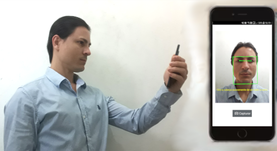

# Verificação de Identidade Digital
Notas sobre o processo de verificação de identidade digital, com foco na prestação de serviços públicos por entidades governamentais.

## O problema
O clamor pela transformação digital e a pressão por serviços remotos nos períodos pandêmico e pós-pandêmico são motores de inovação e exigem criteriosos requisitos de segurança e privacidade.

Qualquer serviço digital que permita o registro ou criação de contas (_onboarding_) está passível de fraude por parte do usuário solicitante, variando de contas _fake_ (onde o usuário não corresponde a uma pessoa legítima) a impersonificação (onde um agente malicioso se passa por uma pessoa legítima).

Devido à dificuldade e ao alto custo muitos serviços abrem mão da verificação, assumindo os riscos de negócio e de imagem. Porém, isso nem sempre está na mesa devido à regulações, _compliance_ ou necessidades de verificação rígidas associadas a custo, requisitos de negócio e privacidade. Notavelmente, redes sociais são exemplos de indústrias com baixo foco em verificação (e alta poluição com perfis _fakes_), em oposição às _fintechs_ (com seus processos de _onboarding_ 100% remotos).

Serviços governamentais frequentemente fazem esse tipo de análise de _trade-off_. Isso parece estar mudando, evidencias dadas pelas iniciativas federal ([gov.br](https://acesso.gov.br/)), estadual ([LoginSP](https://login.sp.gov.br/)) e municipal ([Login Único](https://legislacao.prefeitura.sp.gov.br/leis/decreto-60663-de-25-de-outubro-de-2021/detalhe)) (entre tantas outras) de centralização de identidade do cidadão.

No Brasil esse processo é notavelmente complexo devido à inexistência de cadastros compreensivos unificados com um nível de completude capaz de atender a diversos casos de uso, e à miríade de documentos de identificação e suas múltiplas versões.

Nesse cenário, serão discutidas alternativas para a implantação da verificação de identidade em um cenário plausível de uma aplicação governamental para prestação de serviços ao cidadão, onde ao se registrar é necessária a genuína verificação da identidade do próprio usuário, bem como sua presença física junto ao dispositivo no ato do cadastro.

Verificação de identidade, neste texto, se refere a combinação de diversas atividades realizadas durante o evento de interação onde o usuário alega possuir uma identidade no mundo real, geralmente em sua primeira interação (registro, cadastro, _onboarding_ e afins). Em diversos níveis de tolerância, busca-se verificar se a alegação procede, confirmando se a identidade real existe, se o usuário alegando posse da identidade é o seu verdadeiro possuidor, e sua presença genuína durante o processo.

Além da verificação, outros métodos podem ser utilizados, com menor nível de confiabilidade, para adicionar evidências de suporte à verificação. Vamos chamá-los de métodos de afirmação de identidade. Seu uso como única fonte de verificação é desencorajado.

Buscaremos alternativas à tradicional (e altamente confiável) verificação física de identidade realizada por agentes públicos em balcões de atendimento tradicionais, como no caso do serviço de identidade paulistano [Senha Web](https://www.prefeitura.sp.gov.br/cidade/secretarias/fazenda/servicos/senhaweb/), em prol de soluções nativamente remotas.

## Técnicas

Várias alternativas são utilizadas e disponíveis no mercado. Vamos discutir algumas das alternativas.

### Verificação de identidade do mundo real com foco em documentos

Consiste no uso de dispositivos de captura de imagem (_webcams_ ou câmeras de _smartphones_) em canais digitais remotos (tipicamente aplicações baseadas em _browser_ ou aplicativos _mobile_) para obtenção de imagens ou vídeos de documentos físicos.

  
[Imagem: biometricupdate.com](https://www.biometricupdate.com/201905/digital-identity-and-document-verification-market-to-generate-15-billion-by-2024)

A partir da captura podemos:
- identificar o documento (é um documento conhecido? é um RG ou uma CNH?);
- buscar por sinais de adulteração e falsificação;
- realizar OCR dos textos;
- obter a foto de identificação.

Normalmente esse processo está associado a um mecanismo de detecção de presença "ao vivo" (_liveness detection_, ou _Presentation Attack Detection_). Nesse caso, a foto do documento é comparada com uma _selfie_ do usuário tirada no momento do processo (imagem ou vídeo). Caso haja uma base prévia, também é possível realizar o reconhecimento facial.

  
[Imagem: computerid.com.br](https://computerid.com.br/solucoes/solucoes_view.php?c=10&s=16&p=9)

Este método entrega um nível aceitável de confiança, dada a presença de "algo que _somente você possui_" (seu documento) e "algo que _somente você é_" (sua face).

A técnica também é conhecida como "ID+_selfie_" ou "eKYC" (_eletronic- Know Your Consumer_).

### Afirmação de identidade do mundo real com foco em dados

> __em breve__

### Afirmação de identidade com foco em dispositivos

> __em breve__

### Afirmação de identidade com foco em atributos digitais

> __em breve__

### Afirmação de identidade com foco em análise de comportamento

> __em breve__

### Afirmação de identidade com foco em número de telefone

> __em breve__

## Referências
- KHAN, Akif; CARE, Jonathan. Market Guide for Identity Proofing and Affirmation. Gartner, 2020.
- KHAN, Akif; CARE, Jonathan. Buyer’s Guide for Identity Proofing. Gartner, 2021.
